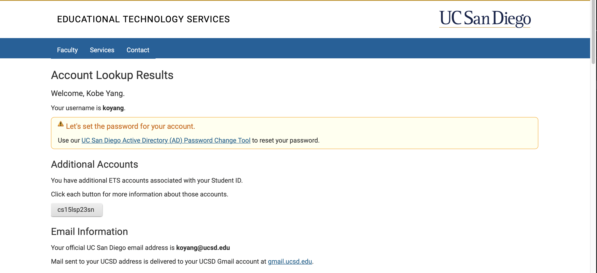
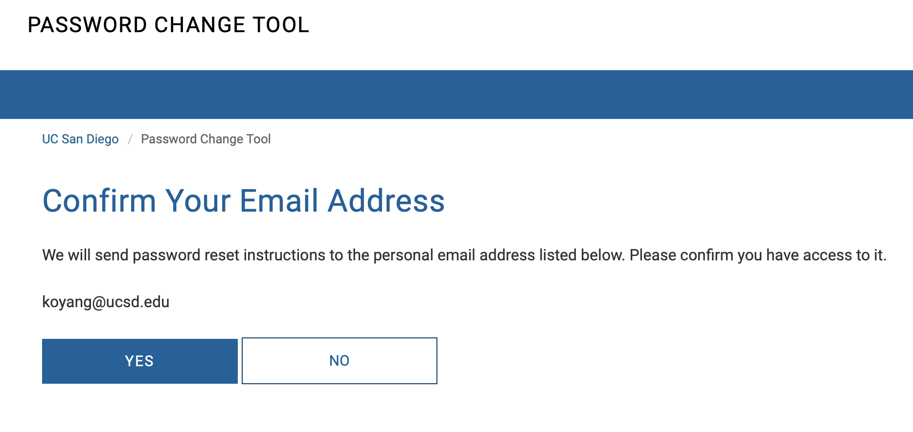
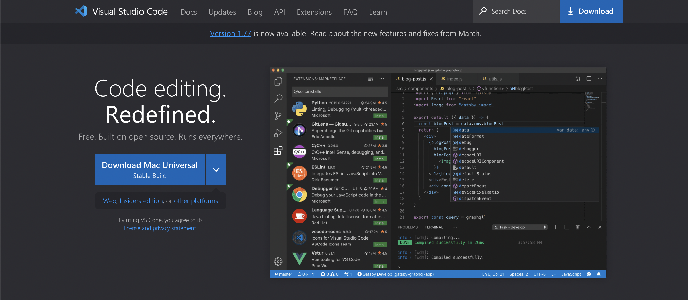
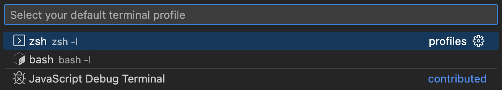
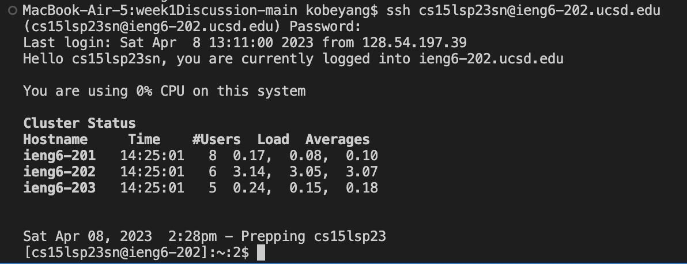
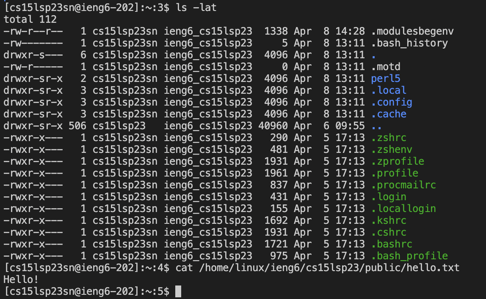
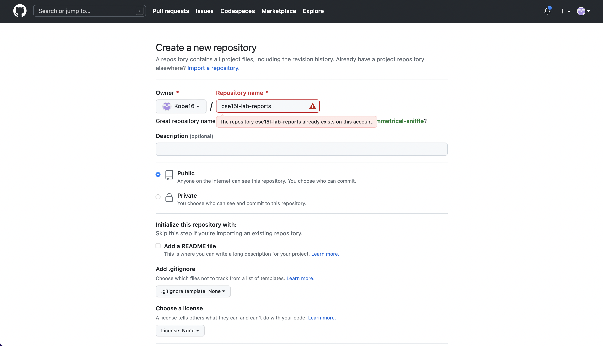
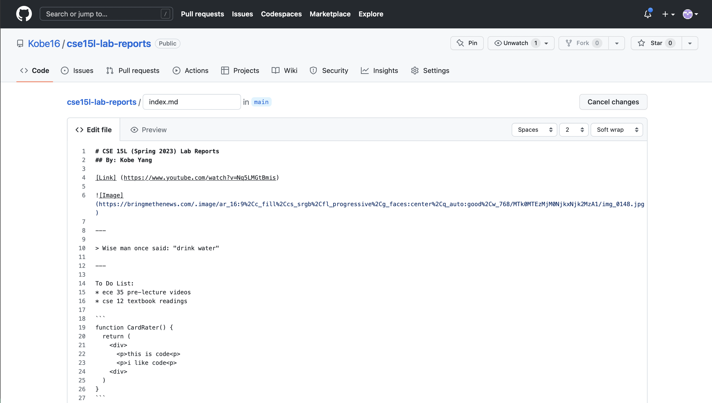

# CSE 15L Lab Report 1
## By: Kobe Yang

In this lab report, I will be showing you how to set up the CSE 15L account. 
This lab report is based on the [CSE 15L Week 1 site](https://ucsd-cse15l-s23.github.io/week/week1/).

1. First, you will be resetting the password for your CSE 15L specific account. 
2. Go to this website and enter your UCSD username and student ID: [UCSD Account Lookup](https://sdacs.ucsd.edu/~icc/index.php)
3. Click on the button that corresponds with your CSE 15L account (cs15lsp23xx)

4. Click the link to go to the "Global Password Change Tool." Then click "Proceed to the Password Change Tool"
5. Enter your CSE 15L account name: cs15lsp23xx, where xx is 2 unique characters for your account. 
6. Click: "I want to reset my course-specific account password." This will send an email to your UCSD to email to change your password. 

7. Create a new password thorugh the link in your email. It should follow these rules: 
- Not be compromised.
- Be different from any previous passwords.
- Be at least 12 characters long.
- Include characters from at least 3 of the following 4 categories: uppercase, lowercase, numbers, and symbols.
- Not contain any part of your username.
- Passphrases are preferred.

8. Now, use this link to install Visual Studio Code: [Visual Studio Code](https://code.visualstudio.com)

9. If on Windows, install Git [Git for Windows](https://gitforwindows.org)
10. On Visual Studio Code, open new terminal (ctrl + `)
11. Type ctrl + shift + p to open the command pallete
12. Type: "Select Default Profile" and click and Bash

13. Now, make a new terminal -- it should be Bash now. 
14. Type the following command: `$ ssh cs15lsp23xx@ieng6.ucsd.edu`, where xx are 2 characters from your username. Type `yes` to any messages that pop up. 
15. Enter your password from before. It'll be invisible when you type it out. Don't worry about this. 
16. It should look something like this if you are successful: 

17. Play around with some of these commands: 

*`$ cd ~`  - changes directory to the home directory

*`$ cd <path> ` - changes directory to specified path

*`$ ls -lat` - lists out all hidden and unhidden files & folders in current directory in long format, by the time last modified. 

*`$ ls -a` - lists out all hidden and unhidden files & folders in current directory

*`$ cp /home/linux/ieng6/cs15lsp23/public/hello.txt ~/` - copies hello.txt to home directory

*`$ cat /home/linux/ieng6/cs15lsp23/public/hello.txt` - prints out the content of hello.txt

In this screenshot, I used the command `$ ls -lat`, which listed out all hidden and unhidden files & folders in current directory in long format, by the time last modified. I then used the command `$ cat /home/linux/ieng6/cs15lsp23/public/hello.txt`, which printed out the content of hello.txt. Notice how I specified the path to the hello.txt file -- this way, the terminal knows where to look for this file. 

18. To exit the remote server, type `$ exit` into the terminal or run ctrl + D. 
19. Now, you will make a Github account. Go to [Github](https://github.com) and make an account
20. Click the plus in the top right corner to make a new Github repo. Name it "cse15l-lab-reports"

21. Click "“Create a new file” and make new file called `index.md`. Use this [website](https://commonmark.org/help/) to help you format it. 

22. Click "Settings", then click "Pages", then select the /root directory as your folder. Click "main" as the source branch
23. You'll now be able to view your `index.md` file as a Github Pages website. 
24. Create another markdown file (.md) in your repo. 
25. To view this markdown file on your github pages website, add `/<markdownFilename>.html` to the end of your github website link. 

Congratualations, you have now completed the starter guide for CSE 15L!
