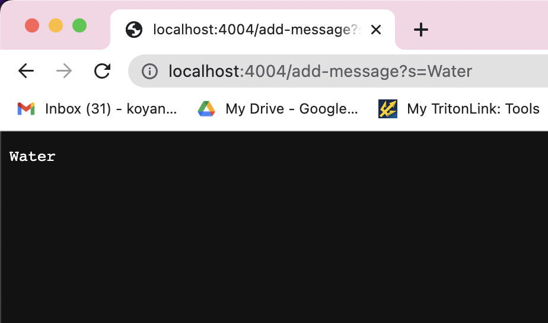
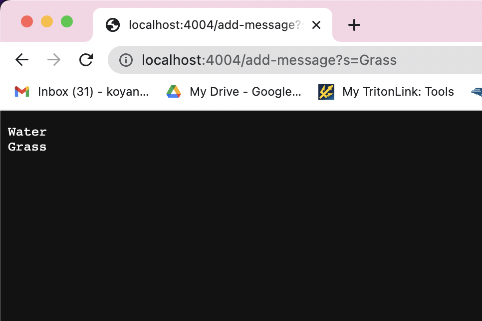

# CSE 15L Lab Report 2
## By: Kobe Yang

In this lab report, I will be demonstrating a web server made in Java. 
This lab report is based on the CSE 15L [Week 2 site](https://ucsd-cse15l-s23.github.io/week/week2/) and [Week 3 site](https://ucsd-cse15l-s23.github.io/week/week3/)

I have created a Java web server called StringServer that will perform a certain action if a certain path and query is inputted. 

There are two main files that are involved in this webserver: `Server.java` (which was provided to us through Week 2's website and contains essential code for setting up and running the web server) and `StringServer.java` (which contains the functionalities of my website, including my path and query options). 

Here is the code for the StringServer: 
```
import java.io.IOException;
import java.net.URI;

class Handler implements URLHandler {
    
    String mainString = ""; 

    public String handleRequest(URI url) {
        if(url.getPath().equals("/add-message")) {
            String[] parameters = url.getQuery().split("=");
            if(parameters[0].equals("s")) {
                mainString += parameters[1] + "\n" ; 
                return mainString; 
            }
        }
        return "404 Not Found"; 
    }
}

class StringServer {
    public static void main(String[] args) throws IOException {
        if(args.length == 0){
            System.out.println("Missing port number! Try any number between 1024 to 49151");
            return;
        }

        int port = Integer.parseInt(args[0]);

        Server.start(port, new Handler());
    }
}
```

The purpose of this code is to take in a path of `/add-message` followed by a question mark and a query in the form of `s=<string>`. 
The server will concatenate the given string and a new line character `"\n"` to a main string. This main string will then be displayed on the site. 
You can repeat this process with more strings, adding more and more strings to the main string. 

An example URL would look like this: `http://localhost:4004/add-message?s=thiswillbethefirststring`

Here is a look at my site in action: 







