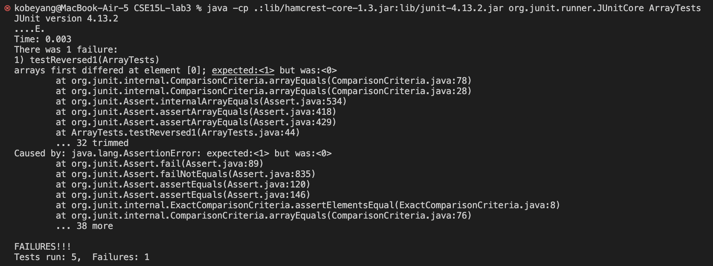

# CSE 15L Lab Report 2
## By: Kobe Yang

In this lab report, I will be demonstrating a web server made in Java. 
This lab report is based on the CSE 15L [Week 2 site](https://ucsd-cse15l-s23.github.io/week/week2/) and [Week 3 site](https://ucsd-cse15l-s23.github.io/week/week3/)

## Part 1

I have created a Java web server called StringServer that will perform a certain action if a certain path and query is inputted. 

There are two main files that are involved in this webserver: `Server.java` (which was provided to us through Week 2's website and contains essential code for setting up and running the web server) and `StringServer.java` (which contains the functionalities of my website, including my path and query options). 

Here is the code for the StringServer: 
```
import java.io.IOException;
import java.net.URI;

class Handler implements URLHandler {
    
    String mainString = ""; 

    public String handleRequest(URI url) {
        if(url.getPath().equals("/add-message")) {
            String[] parameters = url.getQuery().split("=");
            if(parameters[0].equals("s")) {
                mainString += parameters[1] + "\n" ; 
                return mainString; 
            }
        }
        return "404 Not Found"; 
    }
}

class StringServer {
    public static void main(String[] args) throws IOException {
        if(args.length == 0){
            System.out.println("Missing port number! Try any number between 1024 to 49151");
            return;
        }

        int port = Integer.parseInt(args[0]);

        Server.start(port, new Handler());
    }
}
```

The purpose of this code is to take in a path of `/add-message` followed by a question mark and a query in the form of `s=<string>`. 
The server will concatenate the given string and a new line character `"\n"` to a main string. This main string will then be displayed on the site. 
You can repeat this process with more strings, adding more and more strings to the main string. 

An example URL would look like this: `http://localhost:4004/add-message?s=thiswillbethefirststring`

Here is a look at my site in action: 


Here, the string that is added to the main string is `"Water"`

In `StringServer.java`, the `handleRequest` method is called. This method has one argument: URI url. This represents the URL that has just be inputted. 

Within the `Handler` class, the `mainString` string has also been initialized with an empty string. Inside the `handleRequest` method, we first check if the URL's path matches `"/add-message"`. If so, we create the String array parameters, which has two elements: the key and value of the query (these are obtained through the `getQuery().split("=")` method call, which splits the query by `=` and returns the values as elements of an array). We then check if the key of the query matches `"s"`. If so, we then concatenate the query value to `mainString`. The string `"404 Not Found"` is only used when the given path or query key does not match `"/add-message"` and `"s"` respectively. 

The only value that is modified in this method call is `mainString`. The string `"Water" + "\n"` has now been concatenated onto `mainString`.


Here, the string that is added to the main string is `"Grass"`

In `StringServer.java`, the `handleRequest` method is called. This method has one argument: URI url. This represents the URL that has just be inputted. 

Within the `Handler` class, the `mainString` string has also been initialized with an empty string. Inside the `handleRequest` method, we first check if the URL's path matches `"/add-message"`. If so, we create the String array parameters, which has two elements: the key and value of the query (these are obtained through the `getQuery().split("=")` method call, which splits the query by `=` and returns the values as elements of an array). We then check if the key of the query matches `"s"`. If so, we then concatenate the query value to `mainString`. The string `"404 Not Found"` is only used when the given path or query key does not match `"/add-message"` and `"s"` respectively. 

The only value that is modified in this method call is `mainString`. The string `"Grass" + "\n"` has now been concatenated onto `mainString`.


## Part 2
In this section, I will explain the `reversed()` method from Lab 3 and the bug associated with it. The `reversed()` method is meant to return a new array where the items of the original array have been placed in reverse order. 

Here is the original code of the `reversed()` method. It takes an input integer array called `arr`. 
```
static int[] reversed(int[] arr) {
    int[] newArray = new int[arr.length];
    for(int i = 0; i < arr.length; i += 1) {
      arr[i] = newArray[arr.length - i - 1];
    }
    return arr;
  }
```

Here is a failure-inducing input. 
```
@Test
  public void testReversed3() {
    int[] input1 = { 4, 5, 3, 2, 1};
    assertArrayEquals(new int[]{1, 2, 3, 5, 4}, ArrayExamples.reversed(input1));
  }
```

Here is a non-failure-inducing input. 
```
@Test
  public void testReversed2() {
    int[] input1 = {0, 0, 0};
    assertArrayEquals(new int[]{0, 0, 0}, ArrayExamples.reversed(input1));
  }
```

Here is the output of these inputs: 

It seems that the symptom of this code is that it returns an integer array full of zeros, no matter the input array. Why is this? In the second line of the method, we see that we created a new intger array called `newArray`. This is supposed to be the array that we'll put the reverse elements into and return. However, inside the for-loop, we are not actually placing anything inside `newArray`! We are placing the elements of `newArray` into our input array `arr` in reverse order. Since we initialized `newArray` with a specified length, Java automatically filled each element of `newArray` with the default value of zero. This means that we were copying zeros into `arr`. Lastly, we see that we didn't even return `newArray`. Instead we returned `arr`, which is now an array filled with zeros. 

Here is the code after I fixed the bug. I have now made sure that we are writing the values of `arr` into `newArray` this time. Additionally, I have returned `newArray` at the end of the method. This will fix the bugs stated above. 
```
static int[] reversed(int[] arr) {
    int[] newArray = new int[arr.length];
    for(int i = 0; i < arr.length; i += 1) {
      newArray[i] = arr[arr.length - i - 1];
    }
    return newArray;
  }
```

## Part 3
In the past two weeks, I have learned many useful things related to programming. I think the coolest thing that I learned is how to set up a Java web server and making it reactive to inputted paths and queries. This means that we can dynamically generate content based on the user's input. Naturally, you can see how this feature may be used for simple applications, such as a calculator or a simple social media site. I think that the coding behind it is pretty interesting. 


