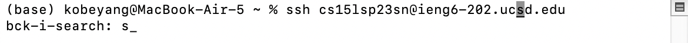
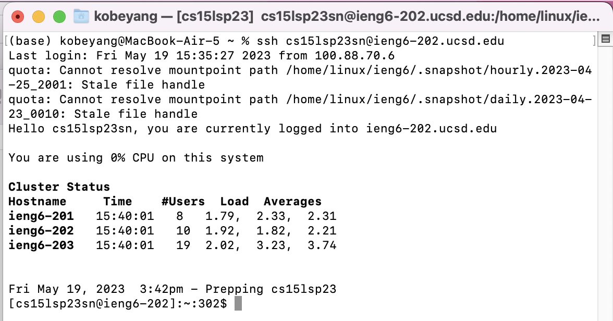
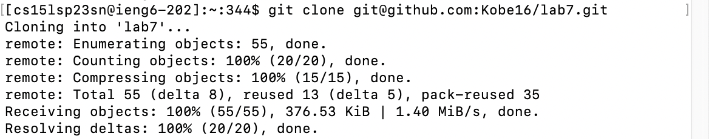
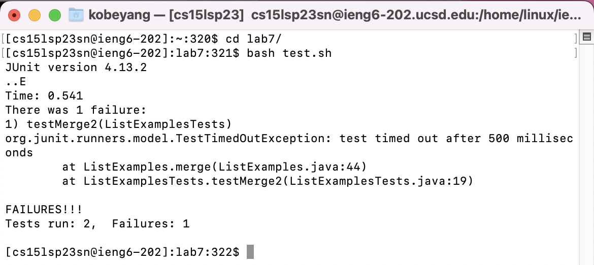
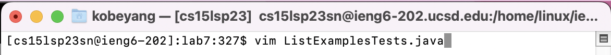
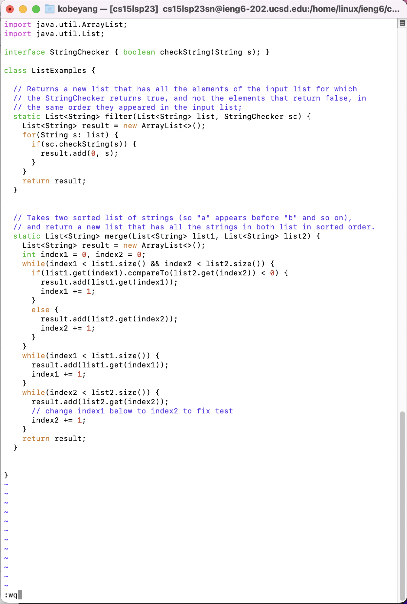
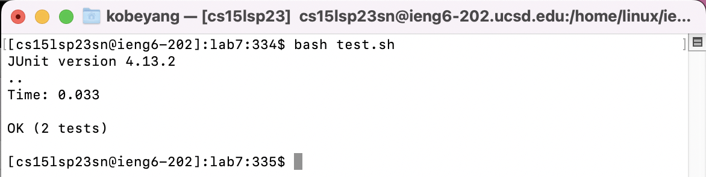
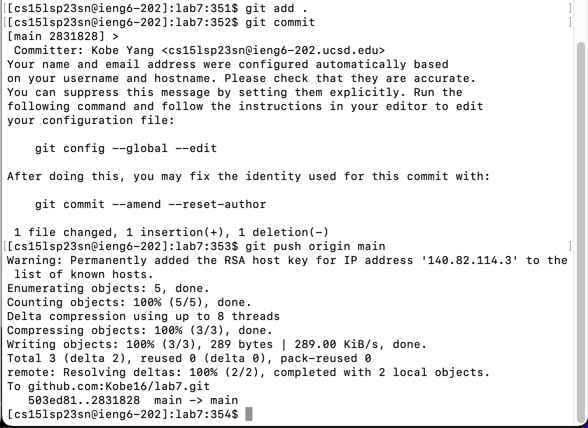

# CSE 15L Lab Report 4
## By: Kobe Yang

In this lab report, I will be using the command line to demostrate some different actions, such as editing with vim, running JUnit tests, and pushing changes to a Github repo. 
This lab report is based on the CSE 15L [Week 7 Website](https://ucsd-cse15l-s23.github.io/week/week7/)

Pre-Setup: 
Before touching the command line, I have forked this repo on Github: [Lab 7](https://github.com/ucsd-cse15l-s23/lab7)

___

1. Log into ieng6 machine. I used the bash history command to search for my previous usage of the command used to log into my ieng6 account. 

Input: 
`<ctrl> <r> <s> <enter>`




___

2. I clone my fork of the lab7 repo using the `git clone` command. Again, I used the bash history command to search for my previous usage of the command. That way, I wouldn't have to type out or copy/paste the Github repo URL. Note: I typed the first few letter of `git clone` into the search command to find the command. 

Input: 
`<ctrl> <r> <g> <i> <t> <space> <c> <enter>`


___

3. I run the JUnit tests to demostrate that the tests fail. First, I must move into the `lab7` directory. Then, I ran the tests using the provided bash script: `test.sh`. These commands are fast to type out, so I didn't bother using the bash history search command. Also, I made sure to use tab to autocomplete the commands. 

Input: 
`<c> <d> <space> <l> <tab> <enter> <b> <a> <s> <h> <space> <t> <tab> <enter>`


___

4. Now, I edit the `ListExamples.java` to fix the error. The error is near the bottom of the file: we are incrementing the value of `index1` by 1, but we should instead be incrementing the value of index2. I will use vim to edit the file. In vim, I use the `<?>` command to search for the last instance of the "1" character in the code (I found this command through this helpful guide online: [Using Vi/Vim: A Brief Tutorial](https://www.cduan.com/technical/vi/vi-1.shtml)). Then, I pressed `n` to move my cursor to the correct instance of the "1" character that I need to change. I use the `r` command to enter 'remove' mode and replace the "1" with a "2" (I learned this command through the vimtutor tool that was used in Lab 7). Lastly, I save and exit vim with `:wq`. 

Input to enter vim: 
`<v> <i> <m> <space> <L> <tab> <.> <tab> <enter>`



Input to edit file: 
`<?> <1> <enter> <n> <r> <2> <:> <w> <q> <enter>`


___

5. I rerun the JUnit tests to demostrate that the tests are now successful. This time, I used the 'up' arrow keys on my keyboard to switch to the previous command that I used to run my tests. Since I had ran my tests right before using vim, they are easy to find.

Input: 
`<up> <up> <enter>`


___

6. I will now commit and push my changes to the Github repo. First, I add my `ListExamples.java` file to the staging area with the `git add` command, before committing it with the `git commit -m` command. I chose a short commit message - "update" - to save time (and because the change I made was so small). Lastly, I push the changes to the remote repo (origin) onto the 'main' branch with the `git push origin main`.

Input to add: 
`<g> <i> <t> <space> <a> <d> <d> <space> <L> <tab> <.> <j> <tab> <enter>`

Input to commit: 
```<g> <i> <t> <space> <c> <o> <m> <m> <i> <t> <space> <-> <m> <space> <"> <u> <p> <d> <a> <t> <e> <"> <enter>```

Input to push: 
`<g> <i> <t> <space> <p> <u> <s> <h> <space> <o> <r> <i> <g> <i> <n> <space> <m> <a> <i> <n> <space>`


___
  
In this lab, I have demonstrated an understanding of the command line and the many details and features that come along with it. 

