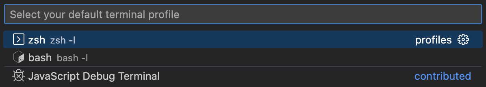

# CSE 15L Lab Report 4
## By: Kobe Yang

In this lab report, I will be using the command line to demostrate some different actions, such as editing with vim, running JUnit tests, and pushing changes to a Github repo. 
This lab report is based on the CSE 15L [Week 7 Website](https://ucsd-cse15l-s23.github.io/week/week7/)

Pre-Setup: 
Before touching the command line, I have forked this repo on Github: [Lab 7](https://github.com/ucsd-cse15l-s23/lab7)

1. Log into ieng6 machine. I used the bash history to search for my previous usage of the command used to log into my ieng6 account. 

Input: 
`<ctrl> <r> <s> <enter>`

